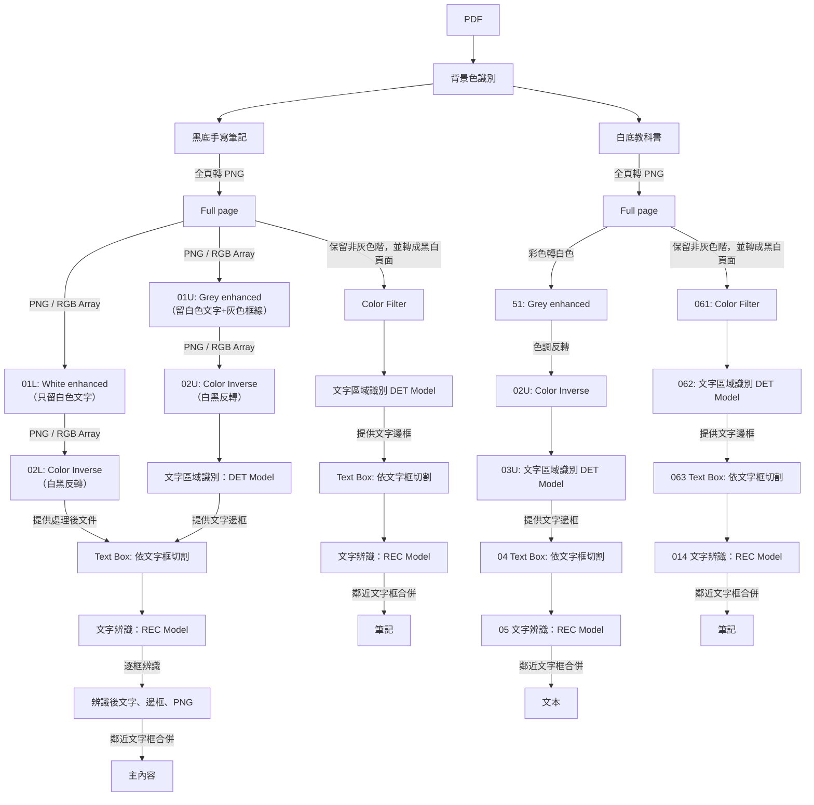

# GoodnotesLoader 使用說明與流程

本模組將 GoodNotes 匯出的 PDF/圖片轉為可檢索的文字內容，覆蓋黑底手寫筆記與白底掃描教材兩種情境。流程包含背景判定、影像前處理、文字區塊偵測（DET）、裁切、文字辨識（REC）、鄰近群組合併與主幹文字萃取，最終回傳每頁的文字與 metadata。

設計重點：

- 可插拔偵測/辨識：默認使用 PaddleOCR，也可注入自定義 Detector/Recognizer。
- 多版本影像前處理：針對黑底/白底產生不同強化版本，提升 DET/REC 成功率。
- 保留 PDF 結構資訊：提供每頁 `page` 與 `outlines`（書籤）等 metadata。

## PDF 頁面 -> 文字內容

目前 Goodnotes 的筆記有兩種形式：

1. 黑底的全手寫筆記
2. 白底的教科書掃描

對於每個頁面，都會經過以下流程



## 快速使用

- 依賴：`pypdf`, `pdf2image`, `pillow`。若要用預設 OCR 模型，還需 `paddleocr`，並安裝系統 poppler 供 `pdf2image` 使用（apt: `poppler-utils`; brew: `poppler`）。

### 極簡端到端（預設 PaddleOCR 模型）

```python
from ingestion.file_loaders.goodnotes.loader import GoodnotesLoader

pdf_path = "data/goodnotes_sample.pdf"  # 你的 GoodNotes 匯出 PDF

loader = GoodnotesLoader(dpi=1000)  # 預設 1000；（我的筆記有不少小字）
results = loader.load(pdf_path)

for i, r in enumerate(results, 1):
    gm = r.metadata  # GoodnotesMetadata
    print(f"Page {gm.page} | bg={gm.extra.get('bg_mode')} | outlines={gm.outlines}")
    # LoaderResult.content 為該頁主幹文字
    print(r.content)
    print("-" * 40)

# 全文件主幹文字：
full_text = "\n".join(r.content for r in results)
```

### 無重 OCR 依賴（以替身跑通流程）

這個版本不需要安裝 `paddleocr`；只需 `pypdf`, `pdf2image`, `pillow`（仍需系統 poppler）。

```python
from ingestion.file_loaders.goodnotes.loader import GoodnotesLoader
from ingestion.file_loaders.goodnotes.types import DetBox

class FakeDetector:
    def predict(self, image):
        w, h = image.size
        # 一個頂部的偵測框；流程會裁切並送到辨識
        return [DetBox(poly=[[10, 10], [w//2, 10], [w//2, 30], [10, 30]], score=0.9)]

class FakeRecognizer:
    def predict(self, image):
        return "DEMO_TEXT", 0.99

pdf_path = "data/any_small.pdf"
loader = GoodnotesLoader(dpi=150, detector=FakeDetector(), recognizer=FakeRecognizer())
for r in loader.load(pdf_path):
    print(f"Page {r.metadata.page} bg={r.metadata.extra.get('bg_mode')}:")
    print(r.content)  # -> "DEMO_TEXT"
```

備註：

- `LoaderResult.content` 僅包含每頁的主幹文字；筆記文字目前不放在 content，可從後續擴展的 `metadata.extra` 取得。
- `metadata.extra['bg_mode']` 為每頁的背景模式（"white" 或 "black"）。
- `outlines` 為從 PDF 萃取的每頁書籤。

## 輸出資料結構

- `LoaderResult`：單頁結果；`content` 為該頁主幹文字；`metadata` 為 `GoodnotesMetadata`
- `GoodnotesMetadata`（見 `loader.py`）：
  - `page`: 頁碼（1-based）
  - `outlines`: 此頁對應的 PDF 書籤（清單）
  - 其餘欄位繼承自 `PDFMetadata`（檔名、標題、作者、建立/修改時間、來源、producer 等）
- 進階資料（可選）：
  - 可在 `metadata.extra` 放入流程中間產物（例如背景判定 `bg_mode`、偵測框統計等）

## 可插拔 DET/REC（自訂接口）

- Detector 預期接口：`predict(image: PIL.Image) -> List[DetBox]`
- Recognizer 預期接口：`predict(image: PIL.Image) -> tuple[str, float] | (text, score)`

上面「無重 OCR 依賴」範例即示範如何注入替身 Detector/Recognizer；正式情境下可包裝任意模型（如 Paddle、ONNX、第三方雲端服務）。

相關型別定義請見：`src/ingestion/file_loaders/goodnotes/types.py`

## DPI 與效能建議

- `dpi` 預設 1000；通常 300–600 已足夠，但我的筆記小字少。較高的 DPI 能提升 DET/REC 成功率，但會顯著增加計算成本與記憶體占用。
- 批次處理時建議先以 300 或 450 驗證品質，再針對特定頁面調高。
- 若使用 GPU 版 OCR/DET/REC，請留意 ONNX/Paddle 在 GPU 記憶體佔用上的差異，詳見專案根 `README.md` 的「備註」章節。

## 與專案其他模組

- 影像原子操作：`ops.py`
- 前處理/管線：`pipeline.py`
- 載入器封裝：`loader.py`
