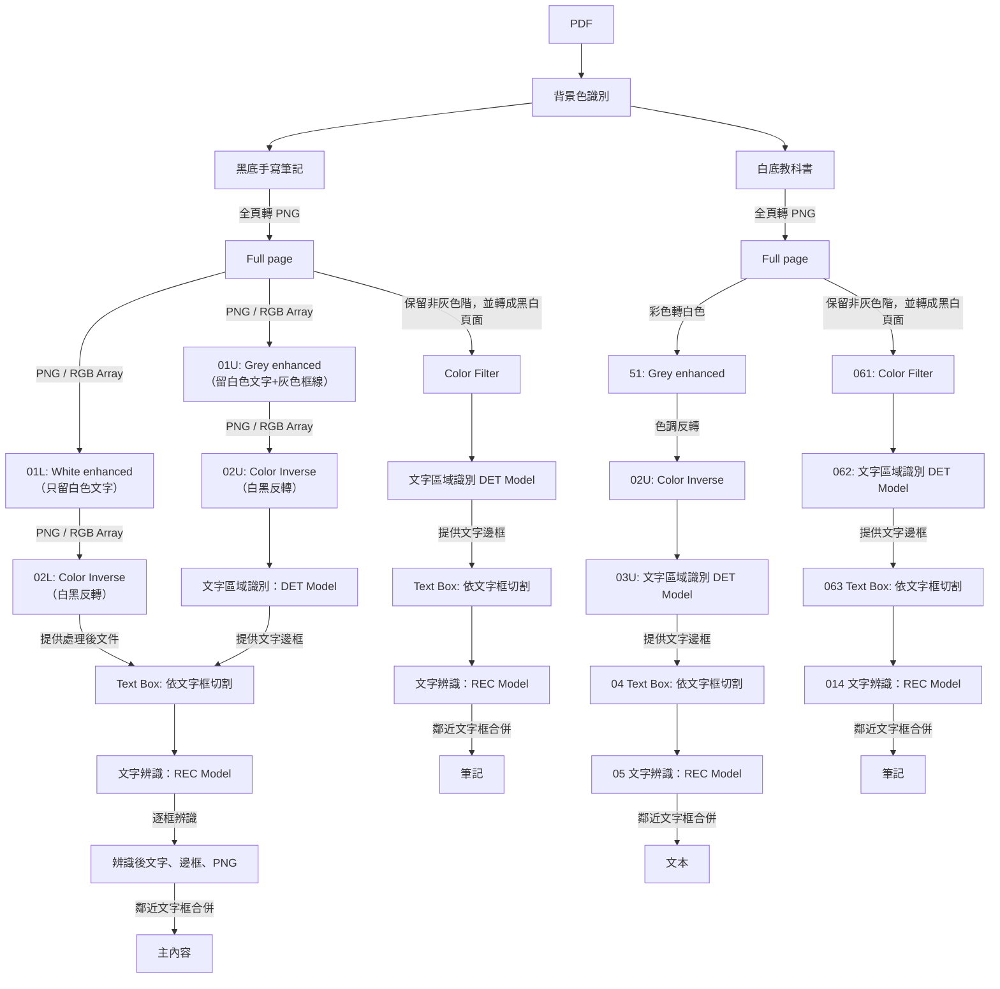

# GoodnotesLoader 流程解釋

## PDF 頁面 -> 文字內容

目前 Goodnotes 的筆記有兩種形式：

1. 黑底的全手寫筆記
2. 白底的教科書掃描

對於每個頁面，都會經過以下流程

```mermaid
flowchart TD
    PDF[PDF] --> BG_COLOR[背景色識別]
    BG_COLOR --> NOTE[黑底手寫筆記]
    BG_COLOR --> TEXTBOOK[白底教科書]
    NOTE -->|全頁轉 PNG| A[Full page]
    TEXTBOOK -->|全頁轉 PNG| B[Full page]

    A -->|PNG / RGB Array| Aw[01L: White enhanced<br>（只留白色文字）]
    A -->|PNG / RGB Array| Ag[01U: Grey enhanced<br>（留白色文字+灰色框線）]
    A -->|保留非灰色階，並轉成黑白頁面| Ac[Color Filter]
    B -->|彩色轉白色| Wg[51: Grey enhanced]
    B -->|保留非灰色階，並轉成黑白頁面| Wc[061: Color Filter]

    Ag -->|PNG / RGB Array| Agi[02U: Color Inverse<br>（白黑反轉）]
    Aw -->|PNG / RGB Array| Awi[02L: Color Inverse<br>（白黑反轉）]
    Wg -->|色調反轉| Wi[02U: Color Inverse]


    Agi --> DET[文字區域識別：DET Model]
    Ac --> DET2[文字區域識別 DET Model]
    Wi --> DETW[03U: 文字區域識別 DET Model]
    Wc --> DETW2[062: 文字區域識別 DET Model]
    DET -->|提供文字邊框| C[Text Box: 依文字框切割]
    DET2 -->|提供文字邊框| C2[Text Box: 依文字框切割]
    DETW -->|提供文字邊框| CW[04 Text Box: 依文字框切割]
    DETW2 -->|提供文字邊框| CW2[063 Text Box: 依文字框切割]

    Awi -->|提供處理後文件| C

    C --> REC[文字辨識：REC Model]
    C2 --> REC2[文字辨識：REC Model]
    CW --> RECW[05 文字辨識：REC Model]
    CW2 --> RECW2[014 文字辨識：REC Model]
    REC -->|逐框辨識| TRUNK_REC[辨識後文字、邊框、PNG]
    REC2 -->|鄰近文字框合併| TRUNK2[筆記]
    RECW -->|鄰近文字框合併| TRUNKW[文本]
    RECW2 -->|鄰近文字框合併| TRUNKW2[筆記]
    TRUNK_REC -->|鄰近文字框合併| TRUNK[主內容]
```
