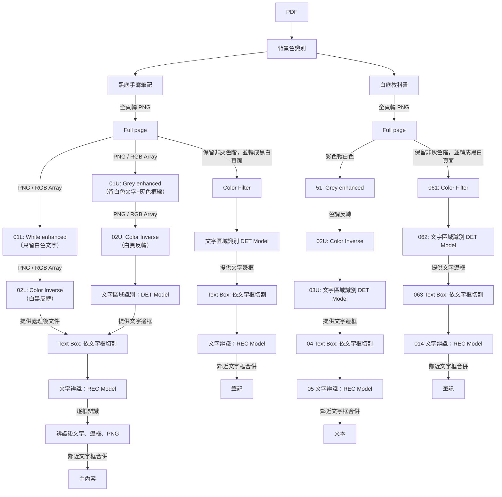

# GoodnotesLoader 流程解釋

## PDF 頁面 -> 文字內容

目前 Goodnotes 的筆記有兩種形式：

1. 黑底的全手寫筆記
2. 白底的教科書掃描

對於每個頁面，都會經過以下流程



## 快速使用

- 依賴：`pypdf`, `pdf2image`, `pillow`。若要用預設 OCR 模型，還需 `paddleocr`，並安裝系統 poppler 供 `pdf2image` 使用（apt: `poppler-utils`; brew: `poppler`）。

### 極簡端到端（預設 PaddleOCR 模型）

```python
from ingestion.file_loaders.goodnotes.loader import GoodnotesLoader

pdf_path = "data/goodnotes_sample.pdf"  # 你的 GoodNotes 匯出 PDF

loader = GoodnotesLoader(dpi=600)  # 預設 1000；300–600 通常夠用
results = loader.load(pdf_path)

for i, r in enumerate(results, 1):
    gm = r.metadata  # GoodnotesMetadata
    print(f"Page {gm.page} | bg={gm.extra.get('bg_mode')} | outlines={gm.outlines}")
    # LoaderResult.content 為該頁主幹文字
    print(r.content)
    print("-" * 40)

# 全文件主幹文字：
full_text = "\n".join(r.content for r in results)
```

### 無重 OCR 依賴（以替身跑通流程）

這個版本不需要安裝 `paddleocr`；只需 `pypdf`, `pdf2image`, `pillow`（仍需系統 poppler）。

```python
from ingestion.file_loaders.goodnotes.loader import GoodnotesLoader
from ingestion.file_loaders.goodnotes.types import DetBox

class FakeDetector:
    def predict(self, image):
        w, h = image.size
        # 一個頂部的偵測框；流程會裁切並送到辨識
        return [DetBox(poly=[[10, 10], [w//2, 10], [w//2, 30], [10, 30]], score=0.9)]

class FakeRecognizer:
    def predict(self, image):
        return "DEMO_TEXT", 0.99

pdf_path = "data/any_small.pdf"
loader = GoodnotesLoader(dpi=150, detector=FakeDetector(), recognizer=FakeRecognizer())
for r in loader.load(pdf_path):
    print(f"Page {r.metadata.page} bg={r.metadata.extra.get('bg_mode')}:")
    print(r.content)  # -> "DEMO_TEXT"
```

備註：
- `LoaderResult.content` 僅包含每頁的主幹文字；筆記文字目前不放在 content，可從後續擴展的 `metadata.extra` 取得。
- `metadata.extra['bg_mode']` 為每頁的背景模式（"white" 或 "black"）。
- `outlines` 為從 PDF 萃取的每頁書籤。
